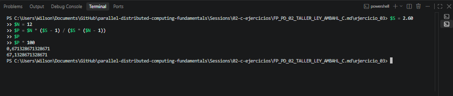

# Ejercicio 3. Estimación de la Fracción Paralelizable

## Objetivo

Estimar qué fracción del programa puede ejecutarse de forma paralela a partir
del speedup experimental obtenido en el ejercicio anterior.

Para realizar esta estimación se utiliza una expresión derivada de la Ley de
Amdahl.

---

## Datos de entrada

Del Ejercicio 2 se obtuvo:

```text
Speedup experimental:

S = 2.60
```

La prueba paralela fue realizada utilizando:

```text
N = 12 hilos
```

Por lo tanto:

| Parámetro | Valor |
|---|---:|
| Speedup experimental `S` | 2.60 |
| Número de hilos `N` | 12 |

---

## Fórmula utilizada

La fracción paralelizable se calcula mediante:

```text
P = N(S - 1) / [S(N - 1)]
```

Donde:

- `P` = fracción paralelizable del programa.
- `S` = speedup experimental.
- `N` = número de hilos utilizados.

---

## Sustitución de valores

Sustituyendo los valores experimentales:

```text
P = 12(2.60 - 1) / [2.60(12 - 1)]
```

Resolviendo primero las operaciones internas:

```text
P = 12(1.60) / [2.60(11)]
```

```text
P = 19.2 / 28.6
```

Finalmente:

```text
P = 0.6713
```

---

## Conversión a porcentaje

Para expresar la fracción paralelizable como porcentaje:

```text
P(%) = 0.6713 × 100
```

Por lo tanto:

```text
P = 67.13 %
```

---

## Resultado

La fracción paralelizable estimada del programa es:

**P ≈ 67.13 %**

La fracción no paralelizable puede obtenerse mediante:

```text
1 - P
```

Por lo tanto:

```text
1 - 0.6713 = 0.3287
```

equivalente a:

```text
32.87 %
```

---

## Interpretación

El resultado indica que aproximadamente el **67.13 % del comportamiento
temporal observado del programa puede asociarse con una parte paralelizable**
bajo las condiciones de la ejecución realizada.

El porcentaje restante, aproximadamente **32.87 %**, representa la parte que
no se beneficia directamente del paralelismo dentro del modelo utilizado.

Esta parte no paralelizable limita el speedup máximo que puede alcanzarse,
incluso si se incrementa el número de hilos.

---

## Análisis

La Ley de Amdahl establece que el rendimiento de una aplicación paralela está
limitado por la parte del programa que permanece secuencial.

En este caso se obtuvo:

```text
Parte paralelizable:     67.13 %
Parte no paralelizable:  32.87 %
```

Esto ayuda a explicar por qué, aunque se utilizaron 12 hilos en el Ejercicio 2,
el speedup experimental fue solamente:

```text
S = 2.60
```

Si todo el programa pudiera paralelizarse de manera perfecta, el incremento
del número de hilos podría producir una mejora mucho mayor.

Sin embargo, en una ejecución real existen diferentes factores que limitan
este comportamiento, entre ellos:

- Secciones secuenciales del programa.
- Creación y sincronización de hilos.
- Sobrecarga introducida por OpenMP.
- Limitaciones del hardware disponible.
- Uso compartido de recursos del procesador.
- Planificación realizada por el sistema operativo.
- Variación en los tiempos de ejecución.

También debe considerarse que el valor obtenido es una **estimación derivada
de una medición experimental**.

Debido a que los tiempos medidos en el Ejercicio 2 fueron muy pequeños, del
orden de milisegundos, pequeñas variaciones en el tiempo de ejecución pueden
producir diferencias apreciables en el valor calculado de `P`.

Por esta razón, el valor de 67.13 % debe interpretarse como una estimación
correspondiente a la ejecución seleccionada y no como una propiedad absoluta
e invariable del programa.

---

## Evidencia del cálculo

La siguiente captura muestra el procedimiento utilizado para calcular la
fracción paralelizable:


cls
---

## Conclusión

Utilizando el speedup experimental obtenido en el Ejercicio 2 y un total de
12 hilos, se aplicó la expresión:

```text
P = N(S - 1) / [S(N - 1)]
```

obteniéndose:

```text
P = 0.6713
```

equivalente aproximadamente a:

```text
P = 67.13 %
```

Esto indica que cerca del 67.13 % del comportamiento del programa puede
considerarse paralelizable bajo las condiciones experimentales utilizadas.

El porcentaje restante, aproximadamente 32.87 %, limita la aceleración total
que puede alcanzarse mediante el incremento del número de hilos.

Este resultado permite observar de manera práctica uno de los principios
fundamentales de la Ley de Amdahl: la presencia de una fracción secuencial
establece un límite al rendimiento que puede obtenerse mediante paralelismo.cd