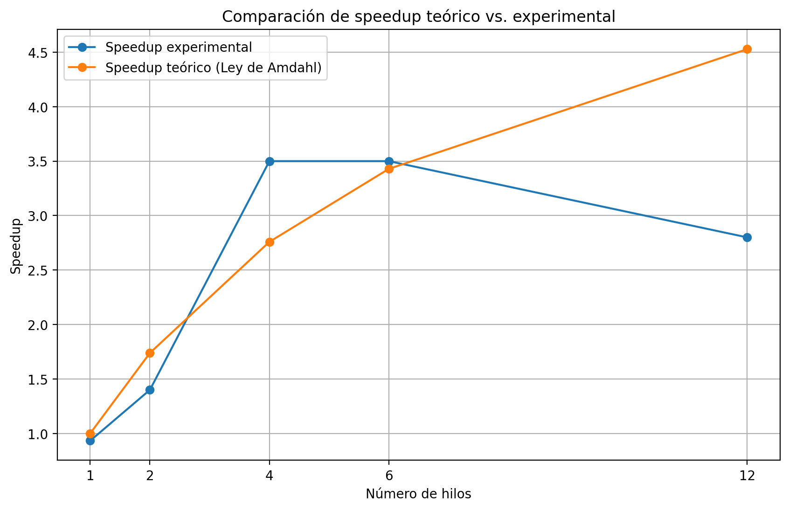

# Ejercicio 5. Comparación Práctica vs. Teórica

## Objetivo

Comparar los resultados experimentales obtenidos al ejecutar el programa
paralelo con diferentes cantidades de hilos frente a los valores de speedup
predichos teóricamente mediante la Ley de Amdahl.

Para ello se ejecutó el programa utilizando:

```text
N = 1, 2, 4, 6 y 12 hilos
```

y se registraron los tiempos de ejecución correspondientes.

---

## Configuración de la prueba

Tanto el programa secuencial como el programa paralelo fueron configurados
con el mismo límite de búsqueda:

```c
#define N 50000
```

En todas las ejecuciones se encontraron:

```text
5133 números primos
```

Esto permite comprobar que todos los casos realizaron la misma tarea y que
el cambio en el número de hilos no modificó el resultado del algoritmo.

---

## Compilación

El programa secuencial fue compilado mediante:

```powershell
gcc primes_number_sequential.c -o sequential.exe
```

El programa paralelo fue compilado utilizando soporte para OpenMP:

```powershell
gcc primes_number_parallel.c -o parallel.exe -fopenmp
```

---

## Tiempo secuencial

La ejecución secuencial produjo:

```text
Primes found: 5133
Sequential Time: 0.014 s
```

Por lo tanto:

```text
Ts = 0.014 s
```

Este valor se utilizó como referencia para calcular todos los speedups
experimentales.

---

## Ejecución con diferentes cantidades de hilos

Para modificar el número de hilos se utilizó la variable de entorno de
OpenMP:

```powershell
$env:OMP_NUM_THREADS=N
```

Los resultados experimentales obtenidos fueron:

| Número de hilos | Tiempo paralelo |
|---:|---:|
| 1 | 0.015 s |
| 2 | 0.010 s |
| 4 | 0.004 s |
| 6 | 0.004 s |
| 12 | 0.005 s |

---

## Evidencia de ejecución

La siguiente captura muestra las diferentes ejecuciones realizadas en
PowerShell:


---

# Cálculo del Speedup Experimental

El speedup experimental se calcula mediante:

```text
Sexp = Ts / Tp
```

donde:

- `Ts` = tiempo de ejecución secuencial.
- `Tp` = tiempo de ejecución paralelo.
- `Sexp` = speedup experimental.

Se utilizó:

```text
Ts = 0.014 s
```

---

## Speedup con 1 hilo

```text
S(1) = 0.014 / 0.015
```

```text
S(1) = 0.933
```

En este caso el speedup es inferior a 1, indicando que la versión paralela
con un único hilo fue ligeramente más lenta que la versión secuencial.

---

## Speedup con 2 hilos

```text
S(2) = 0.014 / 0.010
```

```text
S(2) = 1.400
```

---

## Speedup con 4 hilos

```text
S(4) = 0.014 / 0.004
```

```text
S(4) = 3.500
```

---

## Speedup con 6 hilos

```text
S(6) = 0.014 / 0.004
```

```text
S(6) = 3.500
```

---

## Speedup con 12 hilos

```text
S(12) = 0.014 / 0.005
```

```text
S(12) = 2.800
```

---

# Comparación con la Ley de Amdahl

En el Ejercicio 4 se calcularon los valores teóricos de speedup considerando
una fracción paralelizable:

```text
P = 0.85
```

Los resultados teóricos fueron:

| Hilos | Speedup teórico |
|---:|---:|
| 1 | 1.000 |
| 2 | 1.739 |
| 4 | 2.759 |
| 6 | 3.429 |
| 12 | 4.528 |

Al combinar los resultados teóricos y experimentales se obtiene:

| Hilos | Tiempo paralelo (s) | Speedup experimental | Speedup teórico |
|---:|---:|---:|---:|
| 1 | 0.015 | 0.933 | 1.000 |
| 2 | 0.010 | 1.400 | 1.739 |
| 4 | 0.004 | 3.500 | 2.759 |
| 6 | 0.004 | 3.500 | 3.429 |
| 12 | 0.005 | 2.800 | 4.528 |

---

# Análisis de resultados

## Influencia de la parte secuencial

La Ley de Amdahl establece que el speedup máximo de una aplicación está
limitado por la parte del programa que no puede ejecutarse en paralelo.

En el modelo teórico utilizado en este ejercicio se considera:

```text
P = 0.85
```

por lo tanto:

```text
Parte paralelizable = 85 %
Parte secuencial = 15 %
```

A medida que aumenta la cantidad de hilos, la fracción paralelizable puede
distribuirse entre más recursos de procesamiento, pero la parte secuencial
continúa limitando la aceleración total.

Por esta razón, el speedup teórico no crece de manera proporcional al número
de hilos.

---

## Ejecución con un hilo

Con un solo hilo se obtuvo:

```text
Speedup experimental = 0.933
```

El valor es inferior a 1, lo cual indica que la versión OpenMP fue
ligeramente más lenta que la versión estrictamente secuencial.

Esto puede explicarse por la sobrecarga introducida por OpenMP, ya que incluso
cuando se utiliza un solo hilo deben realizarse operaciones asociadas con la
administración del entorno paralelo.

---

## Ejecución con dos hilos

Con dos hilos el speedup aumentó a:

```text
S = 1.400
```

Esto demuestra que comienza a existir un beneficio derivado de distribuir el
trabajo entre múltiples hilos.

Sin embargo, el resultado fue inferior al valor teórico de:

```text
S = 1.739
```

debido a que una ejecución real incluye sobrecargas y características del
hardware que no están representadas completamente por el modelo teórico.

---

## Ejecución con cuatro hilos

Con cuatro hilos se obtuvo:

```text
S = 3.500
```

Este resultado representa uno de los mejores rendimientos obtenidos durante
la prueba.

El procesador utilizado en el taller dispone precisamente de 4 núcleos
físicos, por lo que esta configuración permite distribuir el trabajo entre
los núcleos disponibles.

El speedup experimental fue incluso superior al valor teórico de 2.759.

Esta diferencia no debe interpretarse como una violación de la Ley de Amdahl.
Los tiempos medidos son extremadamente pequeños y pueden verse afectados por
variaciones del sistema operativo, precisión de la medición, caché y otros
factores de ejecución.

---

## Ejecución con seis hilos

Con seis hilos se obtuvo nuevamente:

```text
S = 3.500
```

El resultado se encuentra muy próximo al valor teórico:

```text
S teórico = 3.429
```

En esta configuración ya se utilizan más hilos que núcleos físicos, aunque
el procesador dispone de 8 procesadores lógicos mediante Hyper-Threading.

Esto permite continuar utilizando cierto paralelismo adicional sin superar
todavía la cantidad de procesadores lógicos disponibles.

---

## Ejecución con doce hilos

Con 12 hilos se obtuvo:

```text
S = 2.800
```

En lugar de aumentar, el speedup disminuyó respecto a las configuraciones de
4 y 6 hilos.

El procesador utilizado dispone de:

```text
4 núcleos físicos
8 procesadores lógicos
```

Por lo tanto, ejecutar 12 hilos significa utilizar una cantidad de hilos
superior al número de procesadores lógicos disponibles.

Esto produce una situación de sobresuscripción, donde el sistema operativo
debe alternar la ejecución de varios hilos sobre los mismos recursos de
procesamiento.

La administración adicional de los hilos y el cambio de contexto pueden
incrementar el tiempo total de ejecución, reduciendo el rendimiento.

---

# Efecto de Hyper-Threading

El procesador Intel Core i5-10210U utilizado en las pruebas cuenta con
4 núcleos físicos y 8 procesadores lógicos.

Hyper-Threading permite que cada núcleo físico gestione más de un hilo,
pero los hilos que comparten un mismo núcleo también comparten diferentes
recursos internos.

Por esta razón, aumentar la cantidad de hilos por encima del número de
núcleos físicos puede continuar generando mejoras, pero estas mejoras no son
equivalentes a disponer de núcleos físicos adicionales.

Los resultados experimentales muestran precisamente este comportamiento.

El rendimiento mejoró considerablemente al pasar de 1 a 4 hilos, pero no se
observó una mejora proporcional al continuar aumentando la cantidad de
hilos.

---

# Comparación general

Los resultados experimentales presentan la siguiente tendencia:

```text
1 hilo   → S = 0.933
2 hilos  → S = 1.400
4 hilos  → S = 3.500
6 hilos  → S = 3.500
12 hilos → S = 2.800
```

El rendimiento aumentó inicialmente con la cantidad de hilos, alcanzando
los mejores resultados experimentales con 4 y 6 hilos.

Al utilizar 12 hilos, el rendimiento disminuyó.

Esto demuestra que agregar más hilos no garantiza una mejora continua en
el rendimiento de una aplicación paralela.

---

# Limitaciones experimentales

Los tiempos medidos durante esta prueba son muy pequeños, del orden de
milisegundos.

Por ejemplo:

```text
0.004 s
0.005 s
0.010 s
```

Por esta razón, pequeñas variaciones de algunos milisegundos producen
cambios considerables en el speedup calculado.

Entre los factores que pueden introducir variabilidad se encuentran:

- Procesos ejecutándose en segundo plano.
- Planificación del sistema operativo.
- Precisión del temporizador.
- Estado de la memoria caché.
- Creación y sincronización de hilos.
- Cambio de contexto entre hilos.

Por esta razón, los resultados corresponden a las ejecuciones experimentales
registradas y deben interpretarse considerando estas condiciones.

---

# Conclusión

La comparación entre los resultados experimentales y teóricos permitió
observar los principios fundamentales de la Ley de Amdahl.

Inicialmente, aumentar la cantidad de hilos produjo una reducción del tiempo
de ejecución y un incremento del speedup.

Los mejores resultados experimentales se obtuvieron utilizando 4 y 6 hilos,
con un speedup aproximado de:

```text
S = 3.500
```

Sin embargo, al aumentar a 12 hilos, el speedup disminuyó a:

```text
S = 2.800
```

Este comportamiento evidencia que el rendimiento de una aplicación paralela
depende tanto de la fracción paralelizable del programa como de los recursos
físicos disponibles y de la sobrecarga asociada con la administración de los
hilos.

Los resultados también muestran que los valores experimentales no coinciden
exactamente con las predicciones teóricas de Amdahl, debido a que un sistema
real incorpora factores adicionales como Hyper-Threading, planificación del
sistema operativo, sobrecarga de OpenMP y variaciones en los tiempos de
ejecución.

En consecuencia, la Ley de Amdahl proporciona un modelo teórico útil para
analizar el potencial de aceleración de un programa, mientras que las pruebas
experimentales permiten observar las limitaciones y características reales
del hardware utilizado.

## Gráfica comparativa

La siguiente gráfica compara el speedup experimental con el speedup teórico
calculado mediante la Ley de Amdahl:

